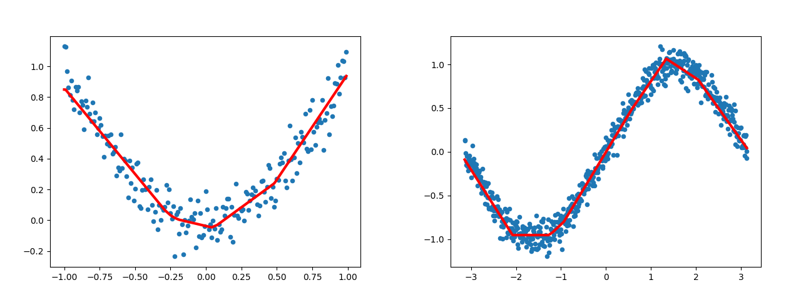
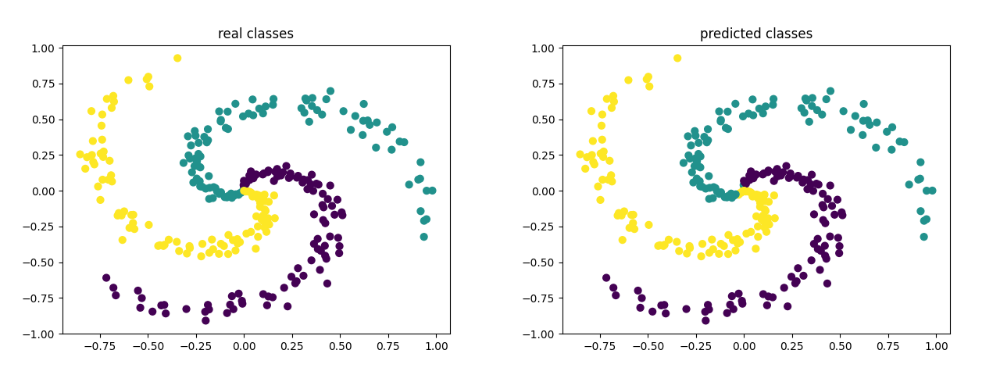

  

# NN-Without-Frameworks
This project aims to implement different Neural Network configuration **without** using scientific frameworks like **TensorFlow** or **PyTorch**.

Each network/config is implemented in 4 formats while trying to mimic [PyTorch's Subclassing](https://pytorch.org/tutorials/beginner/examples_nn/two_layer_net_module.html) procedure:
1. In Python using NumPy
2. In Python without taking advantage of NumPy
3. In java
4. in C++

## What is currently supported? (equally in all languages and formats)
Layers:
- Fully Connected

Activations:
- Linear
- ReLU

Loss functions:
- MSE 
- Cross Entropy

Weight Initializers:
- Xavier Uniform (aka Glorot)
- He Normal (aka Kaiming Normal)

bias initializer:
- Constant (zero)

Optimizers:
- SGD
- SGD + Momentum
- RMSProp
- AdaGrad
- Adam

Regularizer:
- l1
- l2

## Examples

Each directory contains a `train_regression.*` and a `train_classification.*` that perform tests of correctness and functionality according to their corresponding format and language. You can execute them to get a sense of what is going on.

  

  

## Acknowledgement 
- Current code is inspired by the elegant and simple repository [Simple Neural Networks](https://github.com/MorvanZhou/simple-neural-networks) by [@MorvanZhou ](https://github.com/MorvanZhou).
- Mathematical foundation of different parts is based on slides of [CS W182 / 282A](https://cs182sp21.github.io/) course.
## Contributing
- The current code is far from done and any fix, suggestion, pull request, issue, etc is highly appreciated and welcome. 🤗
- Current work focuses on discovering what is under the hood rather optimization involved in implementing ideas so, feel free to conduct sanity-checks behind the math and correctness of each part and/or if you come up with a better or optimized solution, please don't hesitate to bring up a PR. [thank you in advance. 😊]
- You can take a look at `todo.md`.

